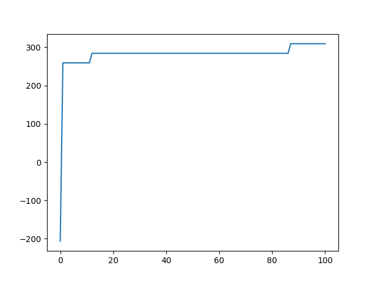

# Knapsack Problem via Genetic Algorithm

Program provides solution to the Knapsack Problem.

Having a knapsack destined for a set of items specified by their weight and value one has to choose their best combination within specified weight maximizing the profit (value).

### Prerequisites

Program written in Python (Version 3.7.1) as a PyCharm project.

Packages required:  
-> matplotlib  

### Run

Main part of the implementation is written in knapsack_ga.py script.
Running the script will automatically calculate the solution to default problem.  

## Customization

There are five arguments of the main fuction that can be modified.

```
items - List of items with value and weight pairs for each  
pop_size - Number of individuals in population.  
elite_size - Number of best fit individuals that always pass through to next generation.  
generations - Maximal number of generations.  
mutation_rate - Represents the probability of the mutation of each backpack content. 
```


Program by default has an exemplary list of items already implemented along with backpack threshold.

```
items = [Item(92, 23), Item(57, 31), Item(49, 29), Item(68, 44), Item(60, 53),
         Item(43, 38), Item(67, 63), Item(84, 85), Item(87, 89), Item(72, 82)]
         
threshold = 165
```

It can be modified freely, depending on user's examples.

## Results 

Result heavily depend on the choice of genetic algorithm parameters.
Due to not many possible solutions small population is recommended (to not find solution by random generation in first generation).
```
pop_size = 25
elite = 5
max_iter = 100
mutation_probability = 0.75
```

For the specified parameters solution to the problem was found after around 90 iterations.



After last generation is calculated, the best solution and it's value is printed out.

```
Solution: [1, 1, 1, 1, 0, 1, 0, 0, 0, 0]
Value of the best solution: 309

```


[Few more data sets to test program with...](https://people.sc.fsu.edu/~jburkardt/datasets/knapsack_01/knapsack_01.html)